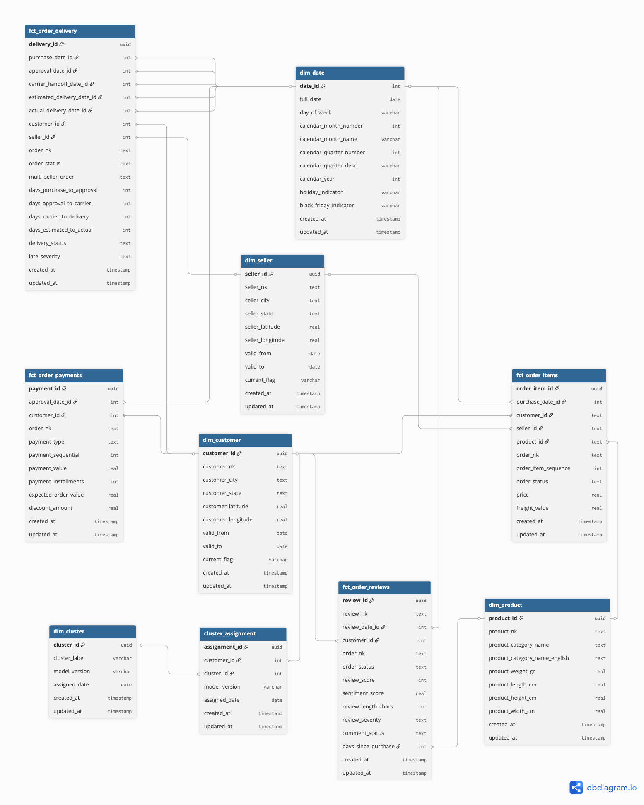

# Exercise 2 \- Data Storage 

## Data Storage, Sekolah Engineering, Pacmann

# Objective

The objective of this exercise is to:

* Implement Slowly Changing Dimensions (SCD)  
* Build an ELT process using Python and SQL  
* Orchestrate the ELT process using Luigi

# Task Description

In the first exercise, you designed a Data Warehouse model for Olist. The next step is to determine the historical data and versioning requirements the company wishes to maintain and building a data pipeline.

## Step \#1 \- Requirements Gathering

A list of Q\&A to ask stakeholder about their need for SCD strategy that will implement based on Olist's business and dataset

| Question 1 Question: "When a seller updates their address or moves to a different city or state, do historical orders from that seller need to reflect the old location or the new one? And how often does this happen in practice?" Answer: This happens more often than you would think, especially for smaller sellers who operate from home and move occasionally. For delivery performance analysis, we need historical orders to reflect where the seller was located at the time of the order. If a seller was in São Paulo when they fulfilled an order but we update their record to show they are now in Rio de Janeiro, our delivery route analysis becomes incorrect. So yes, historical records should preserve the original seller state and city. The old value matters for trend analysis. I would estimate seller location changes happen often across the platform. |
| :---- |
| Question 2 **Question:** "When a product's category is corrected or reassigned in the data source, should historical sales records reflect the old category or the corrected one? Is this usually a genuine business change or a data correction?" **Answer:** Most category changes are corrections, not genuine reclassifications. A seller might list a product under the wrong category and we fix it later. In those cases we want all historical records to reflect the correct category because the old one was simply wrong. Genuine reclassifications where a product legitimately moves from one category to another are very rare. So for product category I would say overwrite is fine. The same goes for product dimensions like weight and size. If those are wrong, we correct them and we want the correction to apply everywhere. |
| Question 3 **Question:** "If a customer moves to a different city or state, should their past orders still show the old delivery address or the new one? Does the delivery destination on historical orders matter for your analysis?" **Answer:** The delivery destination on a historical order is a fact of what actually happened. If a customer was in Manaus when they placed an order and the package was delivered there, that order should always show Manaus as the destination regardless of where the customer lives today. Our on-time delivery analysis by destination state would be completely corrupted if we updated customer location and it changed historical delivery records. So historical orders must always preserve the customer state at the time of the order. This is critical for us. |
| Question 4 **Question:** "If a customer's city or state changes in data source, do your reports need to show both the old and new location, or is it enough to always see the current location?" **Answer:** For most sales reporting we just need the current location. The sales team is not asking where a customer used to live. But for delivery performance reporting the location at time of order matters, as the logistics team has pointed out. The challenge is that the same customer dimension serves both sales reporting and delivery performance reporting. So I think we need to preserve history for location changes rather than just overwriting, at least to protect the delivery performance reports. |
| Question 5 **Question:** "When the clustering model reruns and a customer moves from one segment to another, do you need to see both the old and new segment assignment in your reports? How far back does the segment history need to go?" **Answer:** Yes, we absolutely need both. Tracking movement between segments across model runs is one of our primary use cases. If we retrain the model next month we need to know how many customers moved from At-Risk to High-Value Loyal and vice versa. We want to keep the full history of every model run, not just the most recent one. There is no hard limit on how far back the history needs to go but realistically we would run the model quarterly so we are talking about four snapshots per year at most. |
| Question 6 **Question:** "If a product category name changes, for example a product was listed under the wrong category and later corrected, should historical transaction records show the old category or the corrected one?" **Answer:** For forecasting purposes we need consistency over time. If we are building a model on two years of data and the category name changes halfway through, the model sees it as two different categories. So I would prefer that a category name correction applies to all historical records. For now, overwrite. |
| Question 7 **Question:** "If a product is recategorised after a review was submitted, should the review still be attributed to the original category or the new one? Does this affect your satisfaction analysis?" **Answer:** Honestly the category attribution on reviews is already an approximation since a review covers the whole order experience and not a specific product. Given that, I do not think it matters whether we use the old or new category name. As long as the category name is consistent across the whole dataset at the time we run our reports, the trends will still be meaningful. So overwrite is fine for us.  |

## Step \#2 \- Slowly Changing Dimension (SCD) 

Based on the requirement gathering the following SCD strategies apply to each dimension and attribute and reason chose these strategies.

| Dimension | Attribute | SCD Type | Reason |
| :---- | :---- | ----- | :---- |
| dim\_product | product\_category\_name, product\_category\_name\_english, product\_weight\_g, product\_length\_cm, product\_height\_cm, product\_width\_cm | Type 1 | Category changes are corrections of wrong assignments, not genuine reclassifications. Overwriting ensures the forecasting model sees one consistent category name across the full historical dataset. Physical attribute changes are always corrections of data entry errors. The correct value should apply everywhere |
| dim\_customer | customer\_city, customer\_state, customer\_latitude, customer\_longitude | Type 2 | When a customer moves to a different location, historical orders must still show where the package was actually delivered. Overwriting the old location would corrupt delivery performance analysis by destination |
| dim\_seller | seller\_city, seller\_state, seller\_latitude, seller\_longitude | Type 2 | When a seller moves to a different location, historical orders must still show where the package was shipped from. Overwriting the old location would corrupt delivery route analysis by seller origin state |

**New ERD**

For dim\_customer and dim\_seller, Type 2 requires 3 additional columns that are not in the existing ERD. Here’s the updated version:

<center>
   
</center>

## Step \#3 \- ELT with Python & SQL (50 points) 

1. Workflow  
  <center>
   
   </center>
   

  
  ### How to handle the SCD Strategy:

   | SCD Type | Dimension | Attribute | SCD strategies |
   | :---- | :---- | :---- | :---- |
   | Type 1 | dim\_product | product\_category\_name, product\_category\_name\_english, product\_weight\_g, product\_length\_cm, product\_height\_cm, product\_width\_cm  | Data in the data warehouse final schema will be updated according to attribute of product changes in staging schema. History is not preserved.  If a product in staging does not exist in the final schema yet, insert it.  |
   | Type 2  | dim\_customer | customer\_city, customer\_state, customer\_latitude, customer\_longitude | New row inserted into dim\_customer when any location attribute of customer changes in staging.  The old version is closed by setting valid\_to to the current date and updating attribute current\_flag.  History is preserved.  If a customer in staging does not exist in the final schema yet, insert it as a new active row.   |
   |  | dim\_seller | seller\_city, seller\_state, seller\_latitude, seller\_longitude | New row inserted into dim\_seller when any location attribute of seller changes in staging.  The old version is closed by setting valid\_to to the current date and updating attribute current\_flag.  History is preserved.  If a seller in staging does not exist in the final schema yet, insert it as a new active row.  |

### Data pipeline to process ELT using Python and SQL.

* Workflow Description: **Draw** your workflow and explain **how** it handles your SCD strategy.  
* Data pipeline scripts: /pipeline/src_query/
* include alerts for any errors. 
  * Data pipeline logs: /pipeline/temp/logs/
  * Sentry Error Log:
  


## Step \#4 \- Orchestrate ELT with Luigi 

* Use Luigi to orchestrate the pipeline you created   
  run luigi on terminal:
   ```bash
   luigid --port 8082
   ```

## Step \#5 \- Report
* read the report in [README.md](README.md)

