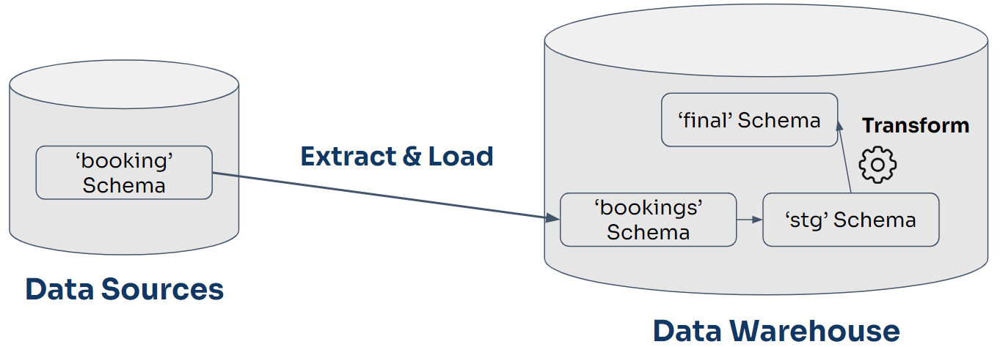
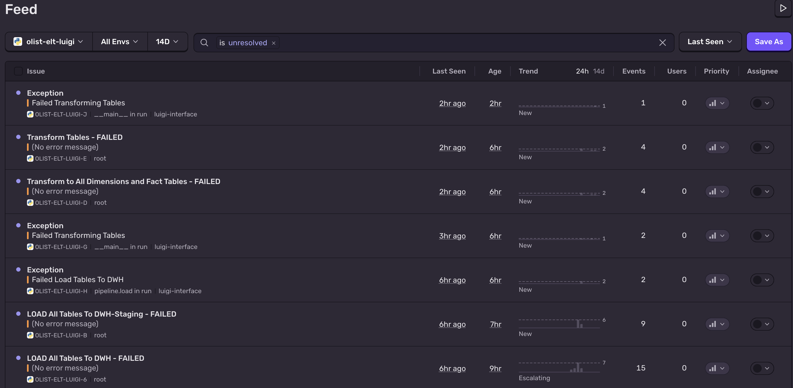

# Olist E-Commerce Data Warehouse Pipeline (ELT)

This project builds a robust, end-to-end Extract, Load, and Transform (ELT) data pipeline for the Brazilian E-Commerce Public Dataset by Olist. The orchestration is powered by **Luigi** and implements a Kimball-style dimensional model using **PostgreSQL**.

---

## Project Overview
The pipeline automatically extracts data from an operational source database, stages it into a Data Warehouse, and transforms the raw records into an analytical schema (Fact and Dimension tables) optimized for Business Intelligence and Reporting.

The pipeline executes the following stages sequentially:
1. **Extract**: Reads transactional tables from the `olist-src` operational database and stores them locally as CSV files.
2. **Load**: UPSERTs the extracted CSV data into a raw staging schema (`stg`) inside the `olist-dwh` database.
3. **Transform**: Processes the staging data into a finalized Star Schema (`final`) applying Slowly Changing Dimensions (SCD Type 1 & 2) and generating Surrogate Keys.

---

## Architecture & Technologies
*   **Orchestration**: `Luigi` (Python)
*   **Source Database**: `PostgreSQL` (Port 5435)
*   **Data Warehouse**: `PostgreSQL` (Port 5434)
*   **Data Processing**: `Pandas`, `SQLAlchemy`
*   **Containerization**: `Docker`, `Docker Compose`


 <center>
    
    </center>

---

## ELT Pipeline Execution           

The pipeline is built using the Luigi Task Framework. Each task inherently depends on the previous one ensuring data integrity.

### 1. Extract Task (`pipeline/extract.py`)
*   **Goal**: Extract raw operational data without placing heavy analytical loads on the source database.
*   **Process**: Iterates through 9 source tables (Products, Customers, Orders, Reviews, etc.) using `all-tables.sql`.
*   **Output**: Dumps the result of each query into `pipeline/temp/data/` as `.csv` files.

### 2. Load Task (`pipeline/load.py`)
*   **Goal**: Move the extracted CSVs into the Data Warehouse landing zone.
*   **Process**: 
    1. Truncates the `public` schema in the DWH.
    2. Reads the temporary `.csv` files using `pandas`.
    3. Loads the data directly into the DWH `public` schema via `to_sql`.
    4. Executes the `stg-*.sql` queries to perform a clean `UPSERT` (Insert or Update) from `public` into the `stg` schema.
*   **Data Integrity**: By utilizing `ON CONFLICT DO UPDATE`, the load process ensures the staging tables only update the `updated_at` timestamp if the incoming record is distinctly different from the existing record.

### 3. Transform Task (`pipeline/transform.py`)
*   **Goal**: Build the Kimball Star Schema.
*   **Process**: Executes SQL scripts that read from the `stg` schema and populate the `final` schema.
*   **Slowly Changing Dimensions (SCD)**:
    *   **SCD Type 1 (Overwrite)**: Applied to `dim_product`. If a product category changes, the old value is overwritten.
    *   **SCD Type 2 (History)**: Applied to `dim_customer` and `dim_seller`. If a customer changes their city, a new row is inserted. The old row is marked with `current_flag = 'Expired'`, and the new row is marked `current_flag = 'Current'`.

---

## Error Monitoring with Sentry

To ensure the reliability of the pipeline, **Sentry** is integrated for real-time error tracking and alerting. Any exception that occurs during the Extract, Load, or Transform stages is automatically captured and reported to the Sentry dashboard for immediate debugging.



---

## How to Run the Pipeline

### 1. Start the Databases
Spin up the source and DWH PostgreSQL containers:
```bash
docker-compose up -d
```

### 2. Execute via Luigi (Terminal)
Run the pipeline directly from the command line:
```bash
PYTHONPATH=. python3 -c "import luigi; from pipeline.transform import Transform; luigi.build([Transform()], local_scheduler=True)"
```
*(Because `Transform` requires `Load`, and `Load` requires `Extract`, this single command triggers the entire ELT workflow).*

### 3. Execute via Jupyter Notebook
* run luigi in the terminal
  ```bash
  luigid --port 8082
  ```
* open the Jupyter Notebook
Open the provided Jupyter Notebooks: `elt-with-luigi-data-storage-olist.ipynb`: Contains the raw Luigi Task code written directly into the cells for interactive debugging. 

Run the cells to execute the pipeline and view the execution summaries.

### 4. Clean Up (Optional)
To clear out the temporary `.csv` dumps extracted from the source DB:
```bash
python3 pipeline/utils/clear_temp.py
```

